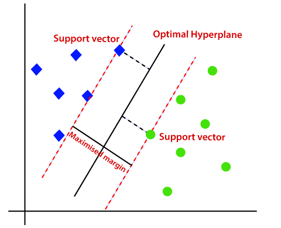
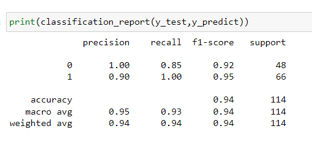
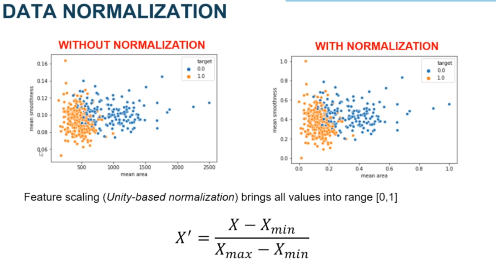
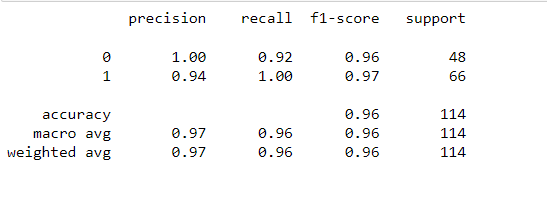
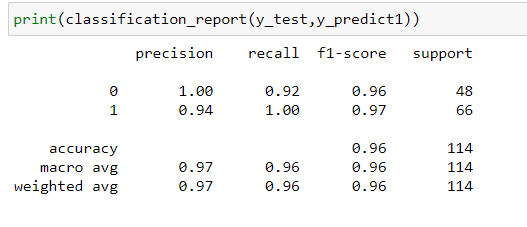

# Project Overview

Cancer occurs as a result of mutations, or abnormal changes, in the genes responsible for regulating the growth of cells and keeping them healthy. The genes are in each cell’s nucleus, which acts as the “control room” of each cell. Normally, the cells in our bodies replace themselves through an orderly process of cell growth: healthy new cells take over as old ones die out. But over time, mutations can “turn on” certain genes and “turn off” others in a cell. That changed cell gains the ability to keep dividing without control or order, producing more cells just like it and forming a tumor.

The term “breast cancer” refers to a malignant tumor that has developed from cells in the breast. Usually, breast cancer either begins in the cells of the lobules, which are the milk-producing glands, or in the ducts, the passages that drain milk from the lobules to the nipple. Less commonly, breast cancer can begin in the stromal tissues, which include the fatty and fibrous connective tissues of the breast.

# Problem Statement

A tumor can be benign (not dangerous to health) or malignant (has the potential to be dangerous). Benign tumors are not considered cancerous: their cells are close to normal in appearance, they grow slowly, and they do not invade nearby tissues or spread to other parts of the body. Malignant tumors are cancerous. Left unchecked, malignant cells eventually can spread beyond the original tumor to other parts of the body. As the physical aspects of the malignant tumor differ from the benign tumor cells, we can measure the physical characteristics such as radius (mean of distances from the center to points on the perimeter), texture (standard deviation of gray-scale values), perimeter, area, smoothness, compactness, concavity, concave points, symmetry or fractal dimension to understand and create two classes of tumor and identify which class each tumor belongs for new samples.

# Metrics

In tumor, cells classification is important to avoid false negatives because if a malignant tumor is predict as benign the patient will not receive treatment. That's why F1 is an ideal metric to score our model.
recall = True positive / (True positive + False negative)
precision = True positive / (True positive + False positive)
In the final model, I will analyse the model performance by using a confusion matrix and score model using the F1 Score which is a method measure performance of binary classification, the F1 score is a measure of a test's accuracy, and is the harmonic average of the precision and recall, where an F1 score reaches its best value at 1 (perfect precision and recall) and worst at 0.
In statistical analysis of binary classification, the F1 score is a measure of a test's accuracy. It considers both the precision p and the recall r of the test to compute the score: p is the number of correct positive results divided by the number of all positive results returned by the classifier, and r is the number of correct positive results divided by the number of all relevant samples (all samples that should have been identified as positive). The F1 score is the harmonic average of the precision and recall, where an F1 score reaches its best value at 1 (perfect precision and recall) and worst at 0.
The project was carried out on the breast cancer dataset compiled for research. It can be found at an on Kaggle
The dataset has the following structure:

Dataset:[Kaggle](https://www.kaggle.com/datasets/uciml/breast-cancer-wisconsin-data)

Number of instances: 569

Number of attributes: 32 (ID, diagnosis, 30 real-valued input features)

Diagnosis (M = malignant, B = benign)

Missing attribute values: none

Class distribution: 357 benign, 212 malignant

All feature values are recoded with four significant digits.

# Exploratory Visualization

Correlation between features

Distribution of Classes

 
Number of Benign : 357       Number of Malignant: 212

Data Distribution
 

# Model

A SVM Classifier was used.
Support Vector Machine(SVM) is a supervised machine learning algorithm used for both classification and regression. Though we say regression problems as well its best suited for classification. The objective of SVM algorithm is to find a hyperplane in an N-dimensional space that distinctly classifies the data points. The dimension of the hyperplane depends upon the number of features. If the number of input features is two, then the hyperplane is just a line. If the number of input features is three, then the hyperplane becomes a 2-D plane. It becomes difficult to imagine when the number of features exceeds three.

 
Without any manipulation technique as scaling  I get the following results:

 
# Model Refinement

# Method 1:

 

# Result Obtained after applying this method 1:

# Method 2: USING SVM AND OPTIMIZING THE C AND GAMMA PARAMETER

Using ** Grid Search** I did an Exhaustive search over specified parameter values for an estimator. The parameters of the estimator used to apply these methods are optimized by cross-validated grid-search over a parameter grid.
I defined functions to apply data manipulation techniques cited before and tested different approaches to measuring results to find the best classifier configuration.

# Final Score:

 

The score can be improved on further analysis and experimentation with various kernels and tweaking of 'C' and 'gamma' parameters.

