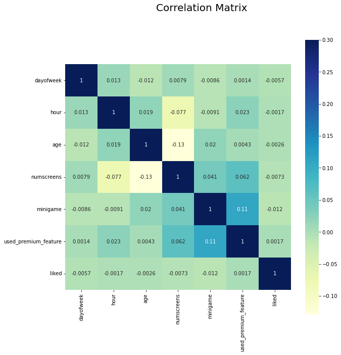
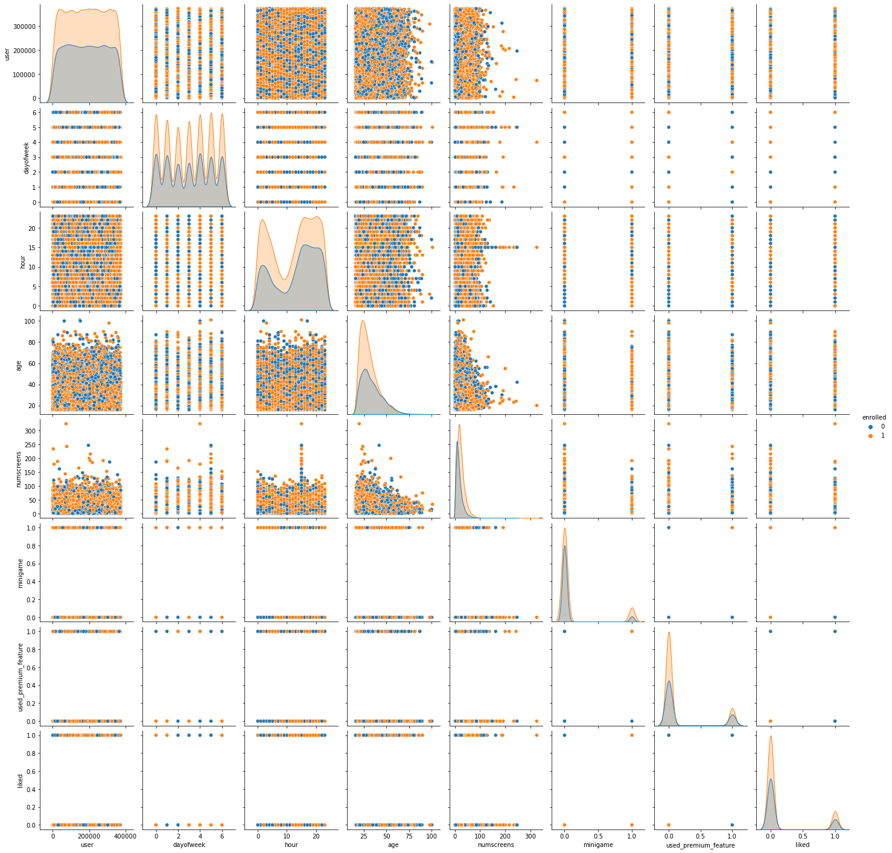
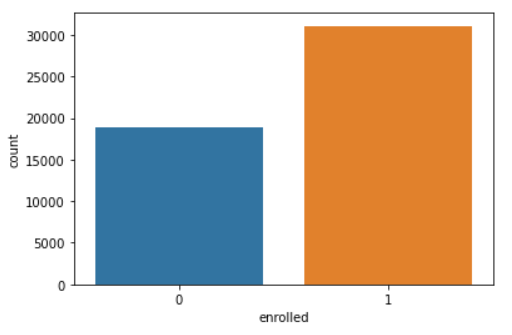
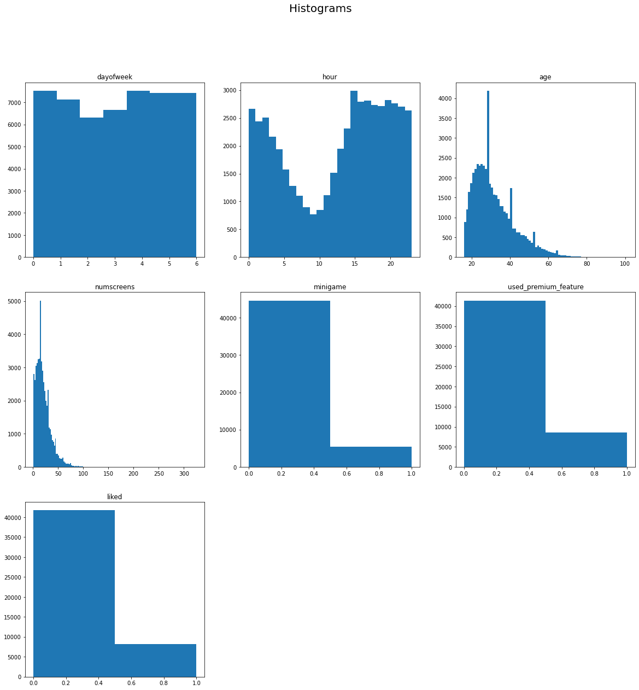
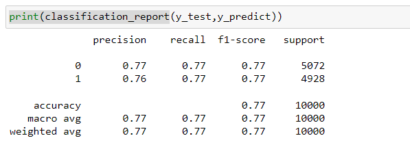

# Directing Customers to Subscription Through App Behavior Analysis

In this Machine Learning end to end project, I am working on financial application data and predict the customer who will take a premium version app subscription or not. Then the company will take action on the customers to give the offers or not. The data contain the customer’s behavior and our job to find the insights from it. To complete this project, we use python programming and it’s libraries NumPy, Pandas, Matplotlib, and Seaborn

# Bussines Problem

The Financial Technology company (Fin-Tech Company) launch there a mobile app. This app used for financial purposes like bank loans, savings, etc. in one place. It has two versions free and premium. The free version app contains basic features and customer wants to use the premium feature then they have to pay some amount to unlock it.

The main goal of the company is to sell the premium version app with low advertisement cost but they don’t know how to do it. That’s a reason they are provided the premium feature in the free version app for 24 hours to collect the customer’s behavior. After that, the company hired the Machine Learning Engineer to find insight from the collected data (customer’s behavior).

# Know about dataset

Dataset is availabe in the Project Folder.

As you can see in fineTech_appData DataFrame, there are 50,000 users data with 12 different features. Let’s know each and every feature in brief.

1. user: Unique ID for each user.

2. first_open: Date (yy-mm-dd) and time (Hour:Minute:Seconds:Milliseconds) of login on app first time.

3. dayofweek: On which day user logon.

0: Sunday

1: Monday

2: Tuesday

3: Wednesday

4: Thursday

5: Friday

6: Saturday

4. Hour: Time of a day in 24-hour format customer logon. It is correlated with dayofweek column.

5. age: The age of the registered user.

6. screen_list: The name of multiple screens seen by customers, which are separated by a comma.

7. numscreens: The total number of screens seen by customers.

8. minigame: Tha app contains small games related to finance. If the customer played mini-game then 1 otherwise 0.

9. used_premium_feature: If the customer used the premium feature of the app then 1 otherwise 0.

10. enrolled: If the user bought a premium feature app then 1 otherwise 0.

11. enrolled_date: On the date (yy-mm-dd) and time (Hour:Minute:Seconds:Milliseconds) the user bought a premium features app.

12. liked: The each screen of the app has a like button if the customer likes it then 1 otherwise 0.

# Data visualization

Heatmap using the correlation matrix

Heatmap uses to find the correlation between each and every features using the correlation matrix.

In the new_df dataset, there is no strong correlation between any features. There is little correlation between ‘numscreens’ and ‘enrolled’. It means that those customers saw more screen they are taking premium app. There is a slight correlation between ‘minigame’ with ‘anrolled’ and ‘used_premium_feature’. The slightly negative correlation between ‘age’ with ‘enrolled’ and ‘numscreens’. It means that older customers do not use the premium app and they don’t see multiple screens.

Pair plot of DataSet

The pair plot helps to visualize the distribution of data and scatter plot.

In pair plot we can see, the maximum features have two values like 0 and 1 and orange dots show the enrolled customer’s features. So we visualize the counterplot of enrolled data.

Countplot of enrolled

Here you can see the exact value of enrolled & not enrolled customers

Histogram of each feature of fineTech_appData2

In the above histogram, we can see minigame, used_primium_feature, enrolled, and like they have only two values and how they distributed.

The histogram of ‘dayofweek’ shows, on Tuesday and Wednesday slightly fewer customer registered the app.

The histogram of ‘hour’ shows the less customer register on the app around 10 AM.

The ‘age’ histogram shows, the maximum customers are younger.

The ‘numsreens’ histogram shows the few customers saw more than 40 screens.

Correlation barplot with ‘enrolled’ feature

Now we are trying to know which feature is strongly correlated with ‘enrolled’ feature with positive or negative through barplot.

We saw the heatmap correlation matrix but this was not showing correlation clearly but you can easily understand which feature is how much correlated with ‘enrolled’ feature using the above barplot.

The ‘numscreens’ and ‘minigame’ is strongly positively correlated with ‘enrolled’ feature than other feature.

The ‘hour’, ‘age’ and ‘used_premium_feature’ are strongly negatively correlated with the ‘enrolled’ feature.

In the above histogram, we know the maximum customers have enrolled the app in 10 hours from the registration.

# Machine Learning Model Building

The target variable is categorical type 0 and 1, so we have to use supervised classification algorithms.

To build the best model, we have to train and test the dataset with LogisticRegression.

# Confusion Matrix

# Classification report of ML model

We have completed the Machine learning Project successfully with 77.77% accuracy which is great for ‘Directing Customers to Subscription Through Financial App Behavior Analysis’ project.

